# Custom Coder Builder



This project builds custom Docker images from the 
[coder/coder](https://github.com/coder/coder) repository. It keeps the upstream
build path intact, runs cleanly from a linux/amd64 builder container, and lets
you override  repository files by mirroring their paths in `overrides/`.

## Quick Start

Recommended on Apple Silicon:

```bash
python3 build-coder-in-docker.py --ref latest-release --tag dev
```

Build directly on a Linux amd64 host with all tools installed:

```bash
python3 build-coder.py --ref latest-release --tag dev
```

Publish to GHCR:

```bash
python3 build-coder-in-docker.py \
  --ref latest-release \
  --image ghcr.io/OWNER/REPO/coder \
  --tag latest \
  --push
```

## What It Does

- Resolves the latest stable Coder release from GitHub, unless `--ref` is set.
- Creates an isolated Git worktree under `.cache/worktrees`.
- Applies path-based overrides from `overrides/`.
- Installs the exact Go version declared by Coder's `go.mod`.
- Runs Coder's upstream build targets.
- Builds and validates a `linux/amd64` Docker image.

## Project Layout

```text
.
|-- build-coder.py              # Main build orchestrator
|-- build-coder-in-docker.py    # linux/amd64 Docker wrapper
|-- Dockerfile.build-coder      # Builder image
|-- overrides/                  # Path-mirrored file overrides
|-- docs/                       # Project documentation
`-- .github/workflows/          # GHCR build workflow
```

## Documentation

- [Configuration](docs/configuration.md)
- [Build Guide](docs/build.md)
- [Architecture](docs/architecture.md)
- [Overrides](docs/overrides.md)
- [Build Workflow](docs/workflow.md)
