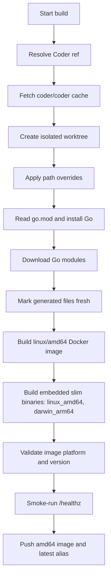

# Build Workflow

The Docker wrapper adds one outer step: build or reuse the `linux/amd64` builder
image, then run this workflow inside it. GitHub Actions builds exactly one
Docker image platform, `linux/amd64`, and limits upstream's embedded slim
binary archive to `linux_amd64,darwin_arm64`.

In GitHub Actions, the `linux/amd64` image also goes through a runtime smoke
test before it is pushed: the workflow starts Coder with temporary Postgres and
waits for `/healthz` to return `OK`.
