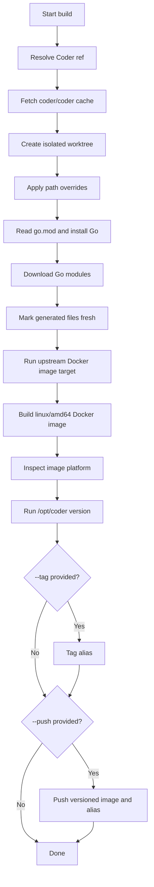

# Build Workflow

```mermaid
flowchart TD
    A["Start build"] --> B["Resolve Coder ref"]
    B --> C["Fetch  coder/coder cache"]
    C --> D["Create isolated worktree"]
    D --> E["Apply path overrides"]
    E --> F["Read go.mod and install Go"]
    F --> G["Download Go modules"]
    G --> H["Mark generated files fresh"]
    H --> I["Run upstream Docker image target"]
    I --> J["Build linux/amd64 Docker image"]
    J --> K["Inspect image platform"]
    K --> L["Run /opt/coder version"]
    L --> M{"--tag provided?"}
    M -->|Yes| N["Tag alias"]
    M -->|No| O{"--push provided?"}
    N --> O
    O -->|Yes| P["Push versioned image and alias"]
    O -->|No| Q["Done"]
    P --> Q
```

The Docker wrapper adds one outer step: build or reuse the linux/amd64 builder
image, then run this workflow inside it.
