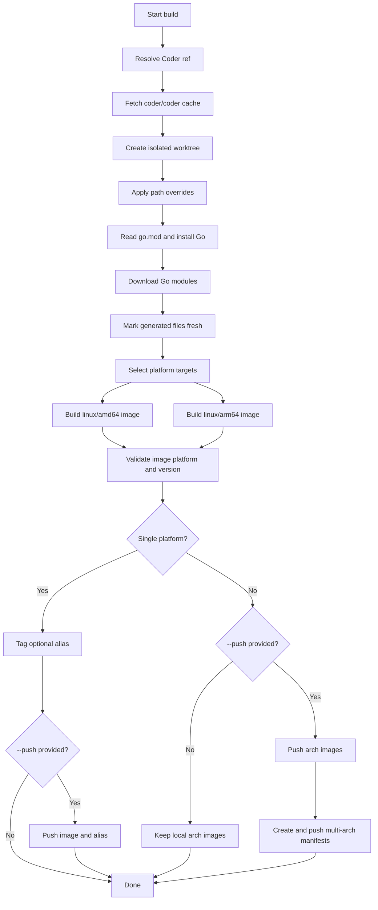

# Build Workflow

The Docker wrapper adds one outer step: build or reuse the `linux/amd64` builder
image, then run this workflow inside it. `PLATFORM=all` builds both supported
architecture images. Multi-arch manifests are created only when images are
pushed, because Docker manifests reference registry images.
